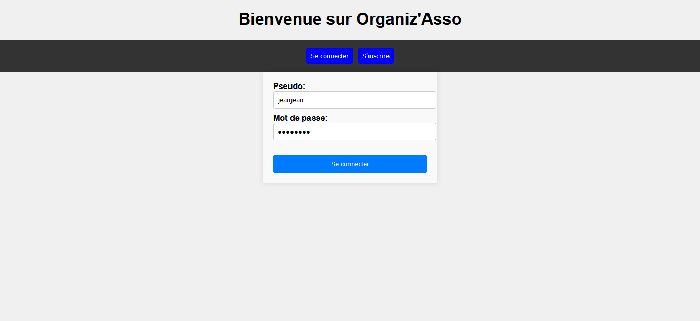
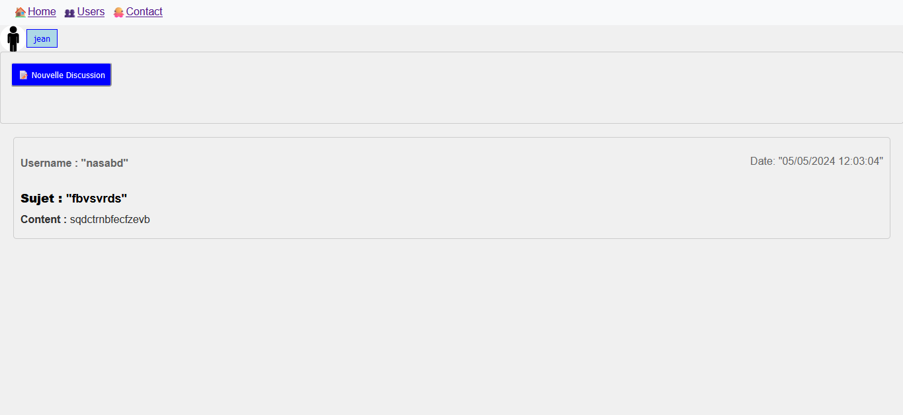
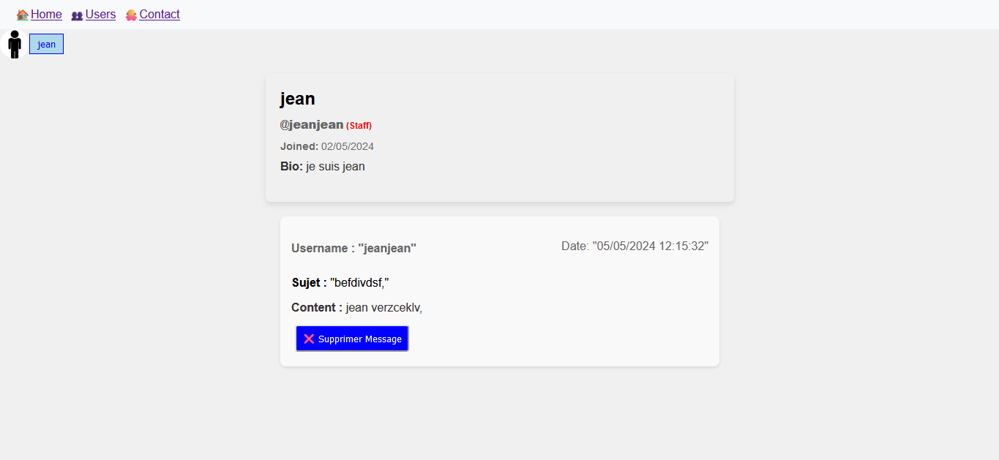

# Organiz’asso - Jeu de mots en React

Le site Organiz’asso permet à des membres d’une association d’échanger des messages avec des forums.

## Fonctionnalités

L’association est pilotée par un conseil d’administration, qui sont des membres élus appelés administrateurs. Il
a deux forums :
- le forum ouvert, que chaque membre inscrit peut consulter et sur lequel il peut poster des messages ;
- le forum fermé, réservé aux membres du conseil d’administration.
Hors connexion, un utilisateur n’a que la possibilité de créer un compte. Son inscription doit être validée par
un administrateur pour lui attribuer le statut de membre.
Lorsqu’un membre se connecte, cela permet d’ouvrir une page principale qui contient le forum ouvert.
Une fois connecté, un membre peut :
- créer des messages :
- soit en réponse à un message précédemment posté
- soit pour démarrer une nouvelle discussion
- visualiser son profil contenant au moins la liste des messages qu’il a publiés. A partir de son profil, il peut supprimer ses propres messages.
- visualiser le profil d’autres membres.
- rechercher des messages en pr´ecisant des mots-cl´es, un intervalle de temps de publication ou leur auteur.
Les administrateurs :
- ont accès au forum fermé
- peut donner ou retirer le statut administrateur à un autre utilisateur, sauf à lui-même
- revoit les inscriptions sur le site, et valide ou non le statut de membre à un utilisateur inscrit.

A la fin de son activité, l’utilisateur a la possibilité de se déconnecter. 

## Captures d'écran





## Utilisation

1. Ouvrez l'application dans votre navigateur.
2. Entrez des lettres pour deviner le mot caché.
3. Recevez des indices visuels après chaque tentative.
4. Une fois le mot deviné ou les tentatives épuisées, la définition du mot sera affichée.

## Architecture du projet

- **src/Components** : Contient les composants React.
- **src/CSS** : Contient les fichiers CSS pour le style de l'application.
- **public** : Contient les fichiers statiques et le fichier HTML de base.

## Exemple de code

### Composant `Motus`

```javascript
import React, { useState, useEffect } from 'react';
import './CSS/Motus.css';
import Grille from './Grille';

const Motus = ({ mot, updateGame, language }) => {
  const [isWin, setIsWin] = useState(null);
  const [definition, setDefinition] = useState('');

  const notifyEnd = (end) => {
    if (end === 'Win') {
      setIsWin(true);
    } else {
      setIsWin(false);
    }
  }

  useEffect(() => {
    if (mot) {
      fetchDefinition(mot);
    }
  }, [mot]);

  const fetchDefinition = async (word) => {
    const url = `https://api.dictionaryapi.dev/api/v2/entries/en/${word.toLowerCase()}`;

    try {
      const response = await fetch(url);
      const data = await response.json();
      if (data && data.length > 0) {
        const definition = data[0].meanings[0].definitions[0].definition;
        setDefinition(definition);
      } else {
        setDefinition('Définition non trouvée.');
      }
    } catch (error) {
      setDefinition('Erreur lors de la récupération de la définition.');
      console.error('Erreur lors de la récupération de la définition:', error);
    }
  };

  return (
    <div className="game-container">
      <Grille mot={mot} notifyEnd={notifyEnd} />
      <div>
        {isWin === true && <p>Félicitations, vous avez gagné!</p>}
        {isWin === false && <p>Perdu !!! Le mot était "{mot}" Réessayez!</p>}
        {isWin === null && <p></p>}
        {isWin !== null && language === 'en' && (
          <div className="definition">
            <h2>Définition de {mot}:</h2>
            <p>{definition}</p>
          </div>
        )}
        {isWin !== null && (
          <button className='retry-button' onClick={() => updateGame(false)}>Rejouer</button>
        )}
      </div>
    </div>
  );
};

export default Motus;
```

## Remerciements
- Merci à l'équipe de Dictionary API pour leur API gratuite.
- Inspiration tirée du jeu télévisé "Motus".

## License

This project is licensed under the MIT License - see the [LICENSE](LICENSE) file for details.

